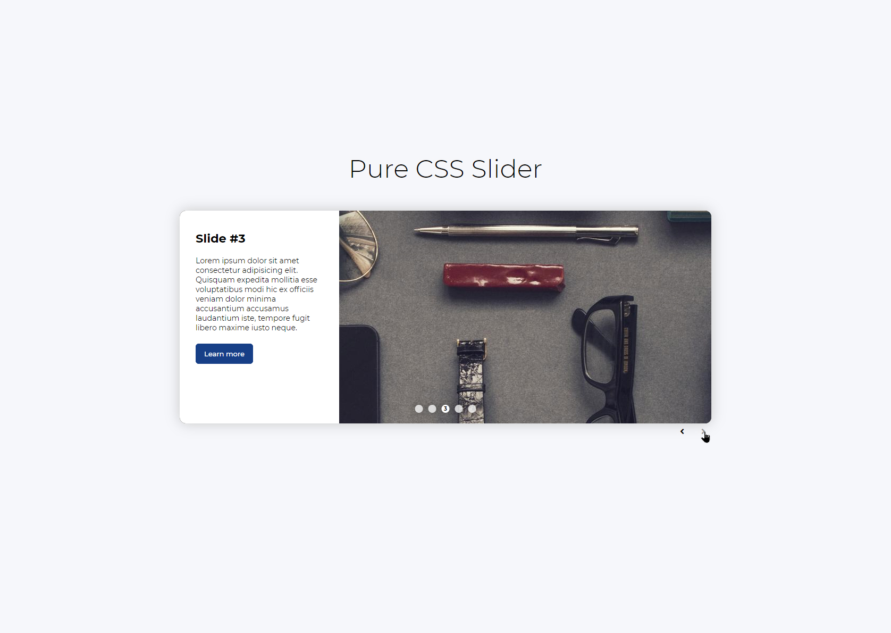

<p align="center">
  <a href="https://rawic.github.io/pure-css-slider/">
    
  </a>

  <h3 align="center">Pure (S)CSS Slider</h3>

  <p align="center">
    CSS Slider (SCSS).
    <br />
    <a href="https://rawic.github.io/pure-css-slider/" target="_blank" rel="noopener noreferrer"><strong>Live demo »</strong></a>
    <br />
    <br />
    <a href="https://rawic.github.io/pure-css-slider/issues">Report Bug</a>
    ·
    <a href="https://rawic.github.io/pure-css-slider/issues">Request Feature</a>
  </p>
</p>

## About Pure (S)CSS Slider

<a align="center" href="https://rawic.github.io/pure-css-slider/" rel="nofollow noopener noreferrer" target="blank">
  
</a>

### Built with

- CSS (SCSS)
- HTML
- Font Awesome
- Google fonts

## Getting started

### Prerequisites

- yarn

```sh
npm install -g yarn
```

### Installation

Using Yarn:

1. Clone the repository

```sh
https://github.com/rawic/pure-css-slider.git
```

2. Go to the project directory

```sh
cd pure-css-slider
```

3. Install packages

```
yarn
```

## Usage

Run the app

```sh
yarn start
```

Build the app

```sh
yarn build
```

## License

Distributed under the MIT License. See `LICENSE` for more information.

## Contact

Rafał Wichowski - [@rafalwichowski](https://twitter.com/rafalwichowski) - [hi@rawic.me](mailto:hi@rawic.me)

Project Link: [https://rawic.github.io/pure-css-slider/](https://rawic.github.io/pure-css-slider/)

[app-screenshot]: readme/app-screenshot.jpg
